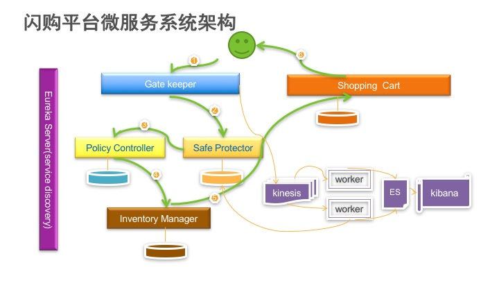

Flash Sale System Demo
=====
Flash sale becomes more and more popular among the ecommerce platforms. but there are few articles/blogs addressed the system in detailed level. And hardly find the code samples. Here we are. This system contains 5 separated micro service: GateKeeper, SafeProtector, PolicyController, InventoryManager and Shopping Cart.
闪购在电商中已经越来越流行。现在很少有资料详细的介绍闪购平台的架构，也很少有源码参考。我这个闪购平台的系统包含了5个微服务：: GateKeeper, SafeProtector, PolicyController, InventoryManager and Shopping Cart.
The objective of the flash sales system is to handle the massive customer requests, filter the traffic based on the business logic ,and protect the back end system.  In order to get more scalability , all this micro service can deployed on Docker.
闪购平台的目标在于能够处理前端大量的请求，按照业务要求请这些请求逐级过滤，并能够很好的保护后端的系统，避免后端系统被巨量的请求压垮。

感谢马利超同学的分享,这个DEMO的许多想法源于此。

Micro Service
====
#####GateKeeper Service
this micro service will sit front of the whole system, it will handle the massive client requests and keep the connection with those clients, and will be re-distribute the request to others micro service.

#####GSafeProtector Service
this micro service will filter the request by IP and Account ID. Once the request matches the blacklisted IP and Account ID, this request will be reject. And we will analytics the traffic in near real-time period , and will update the backlist dynamically.

#####PlicyController Service
this micro service will process the business logic. Currently can set the limitation of purchase unit according to the user level.

#####InventoryManager Service
this micro service will manage the goods inventory. We will check the inventory information when user adding goods to the shopping cart.

#####ShoppingCart Service
this micro service will manage the shopping cart of the customer, and will freeze the quantity of the specified goods when it was added to shopping cart successfully. And will release the goods based on some time periods.

#####EurekaServer Service
this micro service will manage the service discovery  and health mornitoring.

System Architecture
====

Service API
====
|Name |Path | Method  |  Request Body   |  Response Body  |
|-----|-----|---------|-----------------|-----------------|
|doInventoryValidation|/validate/sid/{sid}}/sku/{sku}}/quantity/{qty}|GET| None |{"sessionID":"sid00001","goodsSKU":"SKU0001","goodsQuantity":1,"totalQuantity":1000000,"isAllowed":true,"isThrottled":false,"version":"1.0"}|
|addGoods|/add | POST | {"goodsSKU":"SKU0003","goodsQuantity":5,"goodsPrice":99.9}|{"goodsSKU": "SKU0003","goodsQuantity": 5,"goodsPrice": 99.9}|
|findAllItems|/all | GET | None | [{"goodsSKU":"SKU0001","goodsQuantity":1000000,"goodsPrice":99}]|
|getGoods|sku/{sid}| GET| None | {"goodsSKU":"SKU0001","goodsQuantity":990000,"goodsPrice":45.9} |
|removeGoods|/delete/sku/{sku}}|DELETE|{"goodsSKU":null,"goodsQuantity":0,"goodsPrice":0.0}|
|updateGoods|/update|PUT|{"goodsSKU":"SKU0001","goodsQuantity":900000,"goodsPrice":99.9}|{"goodsSKU":"SKU0001","goodsQuantity":990000,"goodsPrice":45.9}|

Performance
====
To-do

